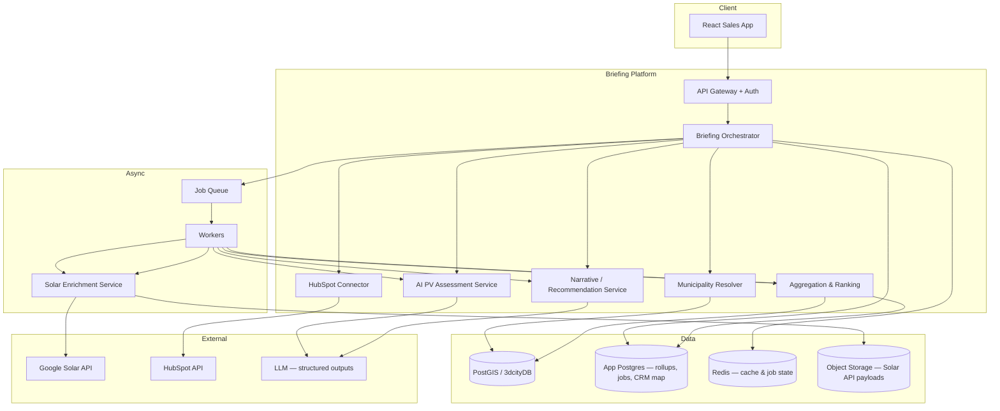
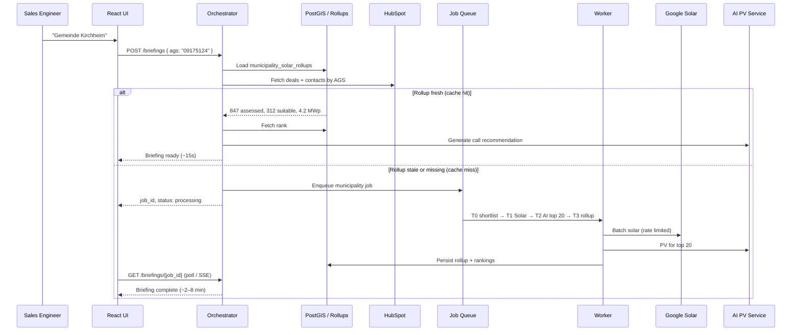

# Admi Municipality Briefing — Complete Interview Package

**Candidate:** Jasser  
**Company:** Admi  
**Deliverable:** System design for automated sales-call briefings  
**Date:** June 2026

---

# PART I — Design Document (Primary Submission)

*Spend ≤3 hours on this section for the interview. The four sections below match the problem statement requirements.*

---

## 1. Clarifying Assumptions

These are the assumptions that most affect the design. In a live conversation, I would validate them first.

| # | Assumption | What I assumed | Why |
|---|------------|----------------|-----|
| 1 | **Municipality ground truth** | The **AGS** (Amtlicher Gemeindeschlüssel) is the canonical identifier; display names like "Gemeinde Kirchheim" are fuzzy. | Germany has many duplicate municipality names across states. AGS is the official key used in government data and should anchor all joins. |
| 2 | **Building data coverage** | 3dcityDB already contains building footprints and addresses for target municipalities, keyed or joinable by AGS / administrative boundary. | The prompt provides PostGIS/CityGML as given infrastructure — design focuses on orchestration, not ingestion. |
| 3 | **CRM linkage** | HubSpot **company** records represent municipalities and have (or will have) an `ags` custom property. Deals and contacts roll up to the company. | Per-building CRM IDs are unrealistic for German municipalities. Briefing CRM section is municipality-scoped. |
| 4 | **"Suitable for solar" definition** | A building is *suitable* if it passes geometric pre-screening (min roof area, max shading proxy) **and** Google Solar returns ≥1 viable roof segment above irradiance and area thresholds. | Aggregates in the briefing (e.g. "312 suitable of 847") need a reproducible rule, not only AI judgment. |
| 5 | **PV economics defaults** | A shared **assumption profile** (panel efficiency 21%, system losses 14%, electricity price €0.32/kWh, feed-in €0.082/kWh) is maintained by Admi and versioned. AI applies the profile; it does not invent tariffs silently. | Sales engineers must defend numbers on calls. Assumptions must be visible and consistent across briefings. |
| 6 | **Latency expectation** | **p95 ≤ 3 minutes** for a briefing when municipality rollup is warm-cached; **≤ 10 minutes** on cold cache (first request for a municipality). | Prompt says "within a few minutes." Cold path requires async processing. |
| 7 | **Briefing audience** | Primary user is a **sales engineer** preparing for a single call — not a municipality-facing report. Tone is internal, actionable, and concise. | Shapes UX (recommendation, CRM, top opportunity) vs. a public PDF. |
| 8 | **Voice input** | Text search is **v1**; voice is **v2** (same backend, speech-to-text in frontend). | Voice adds little architectural complexity but is not required for a 2-week ship. |
| 9 | **Google Solar API limits** | API is rate-limited and billed per request. Caching raw responses is mandatory; re-fetch only on TTL expiry or manual refresh. | Core constraint driving tiered compute. |
| 10 | **AI role boundary** | AI produces **structured PV assessment JSON** and **recommendation narrative** from verified inputs. It does **not** fetch CRM data, resolve municipalities, or fabricate irradiance values. | Separates facts from inference; reduces hallucination risk. |

**Top questions I would ask Admi in the interview:**

1. Do HubSpot companies already store AGS, or is that a data-quality gap we need to solve in v1?
2. Is briefing data allowed to be eventually consistent (nightly rollups), or must every request be fully fresh?
3. Who owns and updates the PV assumption profile — product, finance, or per-customer?
4. Which municipalities are in scope initially (Bayern pilot vs. all Germany)?
5. Are there legal constraints on storing Google Solar API responses long-term?

---

## 2. System Design

### 2.1 Executive summary

The **Municipality Briefing Service** lets a sales engineer enter a municipality name and receive a structured, call-ready briefing in minutes. It orchestrates four existing capabilities — PostGIS building data, Google Solar API, HubSpot CRM, and AI-assisted PV reasoning — behind a React frontend. The central design choice is **tiered computation**: cheap geometric screening and cached municipality rollups at scale, with Google Solar and AI PV analysis reserved for a **shortlisted subset** and deep detail for the **top-ranked buildings**.

### 2.2 Architecture overview



### 2.3 Components

| Component | Responsibility | State |
|-----------|----------------|-------|
| **React Sales App** | Search, disambiguation, job progress, briefing display, assumptions drawer | Client state only |
| **Briefing Orchestrator** | Creates briefing jobs; merges CRM + geo + solar + AI into final payload | Stateless; reads/writes job records |
| **Municipality Resolver** | Fuzzy name → AGS, state, boundary; handles duplicates | Reads `municipalities` table / PostGIS |
| **HubSpot Connector** | Deals, contacts, last activity by company AGS | Cache snapshot per briefing |
| **Solar Enrichment Service** | Calls Google Solar for building lat/lon; stores raw JSON | S3 + `building_solar_cache` |
| **Aggregation & Ranking** | Municipality rollups; suitability rules; top-N ranking | `municipality_solar_rollups`, `building_rankings` |
| **AI PV Assessment** | Roof segments → kWp, yield, CAPEX, payback, CO₂, confidence | `building_pv_assessments` |
| **Narrative Service** | Call recommendation paragraph from briefing context | Ephemeral or stored in snapshot |
| **Job Queue + Workers** | Async pipeline with retries, rate limiting, progress events | Redis + `briefing_jobs` |

### 2.4 How a municipality is identified and looked up

**Flow:**

1. User types `"Kirchheim"` → `GET /municipalities/search?q=Kirchheim`
2. Resolver queries a `municipalities` reference table (name, aliases, AGS, state, `boundary_geom`)
3. If **multiple matches** (e.g. Kirchheim in Bayern and NRW), UI shows disambiguation list with state + AGS
4. User selects **Gemeinde Kirchheim, Bayern · AGS 09175124**
5. All downstream queries use **AGS** as the sole municipality key

**Matching strategy:**

- Trigram / full-text search on normalized names (`Gemeinde` prefix stripped)
- Optional geolocation bias (future)
- Voice (v2): STT → same search endpoint

**PostGIS query** (conceptual):

```sql
SELECT b.building_id, b.address, b.geom, b.function_class
FROM buildings b
JOIN municipalities m ON ST_Within(b.geom, m.boundary_geom)
WHERE m.ags = '09175124';
```

### 2.5 How and when PV calculations are triggered

**Problem:** A municipality may have 50,000 buildings. Calling Google Solar and AI for each on every request is infeasible.

**Solution: three-tier compute model**

| Tier | When | What runs | Output |
|------|------|-----------|--------|
| **T0 — Geometric pre-screen** | Nightly batch or on first briefing request | PostGIS only: roof area proxy, public building flag, footprint size | Shortlist ~500–2,000 candidate buildings per municipality |
| **T1 — Solar enrichment** | Async job after T0; cached 30–90 days | Google Solar API for shortlisted buildings (rate-limited workers) | Roof segments, irradiance per building in `building_solar_cache` |
| **T2 — AI PV assessment** | After T1 for **top 20** ranked buildings; on-demand for user drill-down | LLM with structured output schema + validation | Full PV JSON + narrative per building |
| **T3 — Municipality rollup** | After T1/T2 complete | SQL aggregation over suitable buildings | `municipality_solar_rollups` (counts, MWp, MWh, CO₂) |

**Request-time behavior:**



**Ranking heuristic (top opportunity):** weighted score combining usable roof area, mean irradiance, public/municipal building boost, estimated payback, and CRM signal (existing relationship). Rathaus-type buildings get a modest boost because they are credible anchor projects for municipal sales.

### 2.6 How CRM data is joined to building/geospatial data

**Join model: municipality-level, not building-level**

| Layer | Join key | Data |
|-------|----------|------|
| HubSpot → Municipality | `company.ags` = `09175124` | Deals, stages, contacts, last activity |
| Municipality → Buildings | `buildings.ags` or spatial within boundary | Footprints, addresses |
| Briefing assembly | Orchestrator merges both by AGS at request time | Single briefing payload |

**`crm_municipality_map` table** (for data quality):

- `ags`, `hubspot_company_id`, `match_method` (`ags_exact` | `manual` | `fuzzy_name`), `confidence`
- v1: require `ags_exact` or `manual`; flag unlinked municipalities in UI
- v2: fuzzy name match with human confirmation workflow

**CRM snapshot:** At briefing creation, store a point-in-time copy so the engineer sees what was true when they prepared, even if HubSpot changes before the call.

### 2.7 APIs (illustrative)

| Method | Endpoint | Purpose |
|--------|----------|---------|
| `GET` | `/municipalities/search?q=` | Autocomplete + disambiguation |
| `POST` | `/briefings` | `{ ags }` → `{ job_id, status }` |
| `GET` | `/briefings/{id}` | Full or partial briefing + progress |
| `GET` | `/briefings/{id}/buildings` | Ranked building table |
| `GET` | `/briefings/{id}/buildings/{bid}` | Deep PV JSON |
| `POST` | `/briefings/{id}/refresh` | Re-run stale rollup or assumption profile |

### 2.8 Database design (application layer)

```
municipalities           — ags PK, name, state, boundary_geom
municipality_solar_rollups — ags, counts, aggregate_kwp, mwh, co2, computed_at
building_solar_cache     — building_id, solar_payload_ref, irradiance, fetched_at
building_pv_assessments  — building_id, assumptions_version, assessment_json
building_rankings        — ags, building_id, rank_score, rank_position
briefing_jobs            — id, ags, status, stages, created_by, timestamps
briefing_snapshots       — id, ags, full_json, created_at
crm_municipality_map     — ags, hubspot_company_id, match_method, confidence
assumption_profiles      — version, json (tariffs, efficiency, losses)
```

### 2.9 Deployment

- **React** static host (CDN)
- **API** containers (FastAPI or NestJS) behind load balancer
- **Workers** separate autoscaling group (Solar/LLM bound)
- **PostGIS** managed instance (existing 3dcityDB)
- **App Postgres** for rollups, jobs, CRM map
- **Redis** for job state and hot cache
- **S3** for raw Google Solar responses
- **Secrets** in vault; OpenTelemetry for per-stage latency and cost tracking

### 2.10 UX sketch (one page)

**Page: Municipality Briefing**

```
┌──────────────────────────────────────────────────────────────────────────┐
│  ADMI · Sales Briefing          [Recent ▼]              Jasser (SE)    │
├──────────────────────────────────────────────────────────────────────────┤
│                                                                          │
│   🔍  Search municipality...  [ Gemeinde Kirchheim · Bayern ▼ ] [ Go ]   │
│                                                                          │
├──────────────────────────────────────────────────────────────────────────┤
│  Gemeinde Kirchheim · AGS 09175124 · Bayern          ✅ Ready · 2m 14s │
│  Rollup computed: 14 Jun 2026 · Assumptions v3        [ Refresh ]        │
├────────────┬────────────┬────────────┬────────────┬────────────────────┤
│    847     │    312     │   ~4.2     │  ~3,800    │  ~1,900 t CO₂/yr   │
│  assessed  │  suitable  │   MWp      │  MWh/yr    │  est. savings      │
│            │   (37%)    │            │            │                    │
├────────────┴────────────┴────────────┴────────────┴────────────────────┤
│                                                                          │
│  ┌─────────────────────────────┐  ┌────────────────────────────────────┐ │
│  │  MAP (suitability heatmap)  │  │  TOP OPPORTUNITY                  │ │
│  │  ● green = suitable         │  │  Rathaus, Hauptstraße 12          │ │
│  │  ● gray = not assessed      │  │  280 m² south roof · ~42 kWp      │ │
│  │  ★ = #1 ranked              │  │  Payback: ~7.2 years  [high conf.]│ │
│  └─────────────────────────────┘  │  [ View PV details ]              │ │
│                                     └────────────────────────────────────┘ │
│  ┌──────────────────────────────────────────────────────────────────────┐ │
│  │  CRM STATUS                                                          │ │
│  │  ● 2 active deals — Potential Analysis stage                         │ │
│  │  ● Last contact: 3 weeks ago                                         │ │
│  │  ● Key contact: Hans Müller, Bürgermeister                           │ │
│  └──────────────────────────────────────────────────────────────────────┘ │
│  ┌──────────────────────────────────────────────────────────────────────┐ │
│  │  RECOMMENDATION                                                      │ │
│  │  High-priority lead. Strong irradiance (1,050 kWh/m²/yr), existing   │ │
│  │  relationship via 2022 energy audit. Open with Rathaus as anchor.    │ │
│  │  [ Copy talking points ]                                             │ │
│  └──────────────────────────────────────────────────────────────────────┘ │
│  ┌──────────────────────────────────────────────────────────────────────┐ │
│  │  RANKED BUILDINGS   [Public only ☑] [Min area: 200m²] [Sort: score] │ │
│  │  #  Building          Area   kWp   Payback   Suitability             │ │
│  │  1  Rathaus           280m²  42    7.2y     ████████░░ high          │ │
│  │  2  Grundschule       410m²  58    8.1y     ███████░░░ high          │ │
│  │  3  Feuerwehr         190m²  28    9.0y     ██████░░░░ medium        │ │
│  └──────────────────────────────────────────────────────────────────────┘ │
│                                                                          │
│  [ Assumptions v3 ▼ ]  Panel 21% · Losses 14% · €0.32/kWh · FiT €0.082 │
└──────────────────────────────────────────────────────────────────────────┘
```

**UX principles:**

- **Progress stepper** during cold-cache jobs: Resolve → CRM → Solar batch → Rank → Narrative
- **Disambiguation** before any expensive job starts
- **Confidence chips** on AI-derived numbers; **source tooltips** on API-derived numbers
- **Copy-for-call** button on recommendation block
- **Stale badge** with one-click refresh

### 2.11 Kirchheim walkthrough (end-to-end)

**Input:** Sales engineer types `"Gemeinde Kirchheim"` and selects **Bayern · AGS 09175124** from disambiguation.

| Step | System action | Result |
|------|---------------|--------|
| 1 | Municipality Resolver confirms AGS `09175124`, state Bayern | Canonical entity locked |
| 2 | Orchestrator calls HubSpot: `company.ags = 09175124` | 2 deals (Potential Analysis), Hans Müller, last contact 3 weeks ago |
| 3 | Load `municipality_solar_rollups` — cache hit, fresh | 847 assessed, 312 suitable (37%), ~4.2 MWp, ~3,800 MWh/yr |
| 4 | Load `building_rankings` #1 | `DE_BY_09175124_RATHAUS` — Rathaus, Hauptstraße 12 |
| 5 | Load `building_pv_assessments` for rank #1 | 42 kWp, 38,500 kWh/yr, 6.8y payback, confidence high |
| 6 | Narrative Service: CRM + top building + irradiance context | "High-priority lead… open with Rathaus as anchor project." |
| 7 | UI renders briefing | Engineer ready for call in ~2 minutes |

**Example PV JSON (rank #1 building):**

```json
{
  "building_id": "DE_BY_09175124_RATHAUS",
  "address": "Rathaus, Hauptstraße 12, 85551 Kirchheim",
  "roof_segments": [
    {
      "id": "seg_01",
      "orientation": "South",
      "tilt_deg": 28,
      "usable_area_m2": 180,
      "irradiance_kwh_m2_year": 1080
    },
    {
      "id": "seg_02",
      "orientation": "West",
      "tilt_deg": 28,
      "usable_area_m2": 100,
      "irradiance_kwh_m2_year": 890
    }
  ],
  "pv_assessment": {
    "recommended_system_size_kwp": 42,
    "estimated_annual_yield_kwh": 38500,
    "estimated_capex_eur": 63000,
    "estimated_annual_savings_eur": 9200,
    "payback_period_years": 6.8,
    "co2_savings_tons_per_year": 19.3,
    "confidence": "high",
    "assumptions": [
      "Panel efficiency: 21%",
      "System losses: 14%",
      "Electricity price: 0.32 EUR/kWh",
      "Feed-in tariff: 0.082 EUR/kWh"
    ]
  },
  "narrative": "The Rathaus building has strong solar potential. The south-facing primary segment (180 m²) receives above-average irradiance for Bavaria. A 42 kWp system would cover approximately 65% of the building's estimated annual consumption and deliver a payback period well within municipal funding thresholds."
}
```

---

## 3. AI in This System

### 3.1 Where AI makes the system meaningfully better

| Use case | Why AI | Why not only formulas |
|----------|--------|------------------------|
| **PV assessment JSON** | Combines multi-segment roofs, orientation mix, assumption profile, and building context into sized system + economics + confidence | Pure formulas struggle with nuanced segment combination, missing data, and explaining confidence |
| **Recommendation narrative** | Synthesizes CRM history, aggregate potential, and anchor building into call strategy | Template strings miss relationship context ("2022 energy audit") |
| **Ambiguity explanations** | Optional: explain why a building ranked #1 in human terms | Helps sales trust |

### 3.2 Where AI does **not** belong

- Municipality resolution (deterministic search + AGS)
- Building geometry and counts (PostGIS)
- Irradiance and roof segments (**Google Solar API** — source of truth)
- CRM facts (HubSpot API)
- Aggregate rollups (SQL over cached assessments)

### 3.3 Why a simpler non-AI solution falls short

A spreadsheet or fixed formula can estimate kWp from area, but the prompt requires:

- Per-segment reasoning across multiple orientations
- Explicit, versioned **assumptions** with **confidence**
- A **narrative** tailored to municipal sales context
- Graceful handling of partial or noisy Solar API data

Rules-only systems become brittle and unmaintainable as assumption profiles and building types diversify. AI adds flexibility while structured outputs keep the result machine-readable.

### 3.4 AI-specific risk and mitigation

**Risk:** **Hallucinated or inconsistent financial figures** shown to a prospect on a live call (e.g. payback 4.2 years when math implies 8+).

**Mitigations:**

1. **Structured output schema** — LLM must return typed JSON; reject on parse failure
2. **Deterministic validation** — recompute yield band from kWp × irradiance; flag if AI deviates >15%
3. **Pinned assumption profile** — inject tariffs/efficiency in system prompt; store `assumptions_version` on every assessment
4. **Confidence gating** — hide or watermark low-confidence PV in UI
5. **Provenance UI** — irradiance labeled "Google Solar"; economics labeled "AI estimate given assumptions v3"
6. **Human override** — engineer can trigger re-run with different assumptions before the call

---

## 4. Tradeoffs & What I'd Cut

### 4.1 Two-week v1 — what it looks like

**Ship:**

- Text search with AGS disambiguation
- Briefing orchestrator + job queue (single worker)
- PostGIS building query + **pre-seeded rollups** for 10–20 pilot municipalities (including Kirchheim)
- HubSpot integration via **AGS custom property only**
- Google Solar for **top 50 shortlist** per municipality (manual trigger or nightly cron)
- AI PV for **top 5 buildings** + recommendation narrative
- React: search → progress bar → briefing page (ASCII layout above)
- Assumptions v1 hardcoded, visible in UI

**Cut (and why):**

| Cut | Reason |
|-----|--------|
| Voice input | No architectural blocker; low ROI in 2 weeks |
| Full Germany nightly batch | Ops burden; pilot AGS list is enough to prove value |
| Fuzzy CRM matching | Data quality risk; manual `crm_municipality_map` for pilot |
| Assumption editor | Hardcoded profile sufficient for demo |
| PDF export | Copy-to-clipboard covers v1 |
| Building map heatmap | Table + top opportunity card is enough |
| Multi-municipality compare | Nice sales feature, not core job-to-be-done |
| Full observability stack | Basic logging + job status; defer Grafana dashboards |

### 4.2 Key tradeoffs acknowledged

| Tradeoff | Choice | Rationale |
|----------|--------|-----------|
| Freshness vs speed | Eventual consistency for rollups; real-time CRM | Solar data changes slowly; CRM should be live |
| Accuracy vs cost | Top-20 AI PV, not all buildings | Bounded API spend |
| Flexibility vs auditability | AI economics with validation | Sales trust requires defensible numbers |
| Monolith vs microservices | Modular monolith + worker in v1 | Faster ship; split services when team grows |

### 4.3 Success metrics for v1

- Median time from search → briefing **< 3 min** (warm cache)
- **≥ 80%** of pilot municipalities link cleanly to HubSpot by AGS
- Sales engineers use briefing on **≥ 1 call per week** in pilot
- Zero briefings with **invalid AGS** (disambiguation prevents wrong municipality)

---

# PART II — Hiring Playbook (Reference)

*Condensed from full recruiter/architect analysis. Use for prep; submit Part I to Admi.*

## Business problem

Sales engineers spend **2–4 hours** manually assembling municipality briefings before calls. Automation targets **minutes**, with structured solar + CRM + recommendation output.

## Users

- **Primary:** Sales engineer (pre-call prep)
- **Secondary:** Sales manager (pipeline consistency)
- **Implicit:** Interview panel (design thinking)

## Submission tiers

| Tier | What it looks like |
|------|-------------------|
| **Basic** | Generic diagram; PV on all buildings; vague AI |
| **Good** | Tiered compute, CRM join, assumptions, 2-week v1 |
| **Outstanding** | Cost model, failure modes, confidence/provenance, live Kirchheim walkthrough |

## Deliverables ranked (this interview)

1. ★★★★★ Four-section design doc (Part I)
2. ★★★★★ Architecture diagram + Kirchheim walkthrough
3. ★★★★☆ Assumptions + v1 cuts + AI risk
4. ★★★☆☆ Figma or thin React mock
5. ★★☆☆☆ Full dashboard / demo video / CI/CD cloud deploy

**Hasnae's email:** thought process > polished build. **Do not over-build at the expense of design depth.**

## Tech stack (recommended)

| Layer | Choice | Perception |
|-------|--------|------------|
| Frontend | React + TypeScript | Aligns with prompt |
| API | FastAPI (Python) or NestJS | Either fine if justified |
| Queue | Redis + Celery / Bull | Async solar jobs |
| DB | PostGIS + Postgres app tables | Data engineering fit |
| AI | LLM structured outputs | Disciplined AI boundary |
| Cache | Redis | Job state + hot rollups |

## MVP vs premium

**MVP (2 weeks):** Part I design + optional mock APIs + single briefing page  
**Premium (extra time):** Voice, PDF, analytics, Docker compose, deployed demo, assumption editor

## Dashboard pages (if building UI)

1. Briefing Home — search + recent
2. Municipality Briefing — KPIs + top opportunity + CRM + recommendation
3. Building Explorer — ranked table + drill-down
4. Ops (internal) — job health, API cost

## Hireability scoring (design-first path)

| Dimension | Target |
|-----------|--------|
| Technical depth | 8/10 with tiered compute |
| Product thinking | 8/10 with sales-trust UX |
| Communication | 9/10 with practiced Kirchheim narration |
| **Overall** | **~8/10** with strong live session |

**7→8:** Assumptions table, sequence diagram, v1 cuts, practice narration  
**8→9:** Cost estimates, failure modes, CRM edge cases, Figma/mock  
**9→10:** Handle live curveballs; assumption versioning; optional thin prototype

---

# PART III — Interview Preparation (Phase 7)

## Questions they may ask + sample answers

### Walkthrough: "What happens when I type Gemeinde Kirchheim?"

> We resolve to AGS `09175124` via search and disambiguation — Bayern has multiple Kirchheims, so we never guess. In parallel we pull HubSpot by AGS. If the municipality rollup is warm, we return aggregates and the #1 ranked building with cached PV in under a minute. On a cold cache we enqueue a job: PostGIS shortlist → Google Solar batch → AI PV on top 20 → SQL rollup → recommendation narrative. The UI polls or streams progress. Target p95 under three minutes warm, under ten cold.

---

### Technical: "Why not Google Solar for every building?"

> Scale and cost. A large Gemeinde can have 50,000 buildings. At roughly one API call per building, that's hours and significant spend per briefing. We tier: geometric pre-screen in PostGIS, Solar API only for hundreds of candidates, AI PV only for the top ranks. Rollups are cached and refreshed on schedule or manual refresh.

---

### Architecture: "Where does state live?"

> Geometry and buildings in PostGIS/3dcityDB. Application state — rollups, rankings, PV assessments, job status, CRM map, briefing snapshots — in app Postgres. Raw Solar API JSON in object storage. Hot job progress and rollup cache in Redis. HubSpot remains CRM source of truth; we snapshot at briefing time.

---

### AI: "Why AI for PV?"

> The deliverable needs multi-segment reasoning, explicit assumptions, confidence, and a sales narrative — not just kWp = area × factor. AI handles that synthesis when constrained by schema validation, assumption versioning, and deterministic range checks on top of Google Solar facts.

---

### AI risk: "What keeps the model from inventing numbers?"

> Irradiance comes only from Google Solar. AI fills economics and narrative from a pinned assumption profile. We validate outputs against plausibility bands, store assumptions_version, show confidence in UI, and label provenance. Low-confidence assessments are visually distinct.

---

### CRM: "How do you join HubSpot to buildings?"

> Municipality-level via AGS on the HubSpot company record. Buildings join through AGS in PostGIS. We don't need per-building CRM IDs. If AGS is missing, v1 shows 'CRM unlinked' and we maintain a manual mapping table for pilot customers.

---

### Trade-off: "What do you cut for two weeks?"

> Voice, nationwide batch jobs, fuzzy CRM, map heatmap, PDF export, assumption editor. We ship text search, disambiguation, pilot municipality rollups, HubSpot by AGS, top-5 AI PV, recommendation, and a single briefing page with progress UI.

---

### Business: "How does this help Admi win deals?"

> It turns two to four hours of prep into minutes and standardizes quality. Every engineer opens with a data-backed anchor project and real CRM context — more calls per week and stronger first impressions with municipal decision-makers.

---

### Curveball: "HubSpot doesn't have AGS today."

> I'd add AGS as a required custom property for municipal companies, backfill pilot accounts manually, and use `crm_municipality_map` for exceptions. Briefing still works for solar; CRM section shows 'unlinked' until data is fixed. I wouldn't fuzzy-match company names in v1 without human confirmation.

---

### Curveball: "Google Solar is down."

> Return degraded briefing: cached rollup if available, CRM live, top building from last known ranking, banner 'Solar data unavailable — showing cached assessment from [date].' Block new cold-cache jobs until API recovers.

---

### Closing: "What would you ask us?"

1. Is AGS already on HubSpot companies?
2. Which municipalities are pilot scope?
3. Who owns PV assumption updates?
4. Is eventual consistency on rollups acceptable for sales?
5. Any GDPR constraints on storing Solar API payloads?

---

# PART IV — Presentation Outline (Optional Slides)

| # | Title | Key content |
|---|-------|-------------|
| 1 | Title | Admi Municipality Briefing — Jasser |
| 2 | Problem | 2–4 hr manual prep |
| 3 | Users | Sales engineer job-to-be-done |
| 4 | Solution | Tiered compute, minutes not hours |
| 5 | Architecture | Mermaid from §2.2 |
| 6 | Scale strategy | T0–T3 tiers + sequence diagram |
| 7 | CRM join | AGS as primary key |
| 8 | AI boundaries | Facts vs inference |
| 9 | UX | ASCII briefing page |
| 10 | Kirchheim example | Walkthrough table §2.11 |
| 11 | v1 scope | What we cut |
| 12 | Q&A | Your questions for Admi |

---

---

# PART V — Thin React Mock (Bonus)

A minimal interactive prototype lives in `briefing-mock/` with mocked Kirchheim data.

```bash
cd briefing-mock
npm install
npm run dev
```

Features: municipality search, disambiguation, simulated job progress, full briefing UI.

---

*End of Jasser-doc — Part I is the submission-ready design document.*
